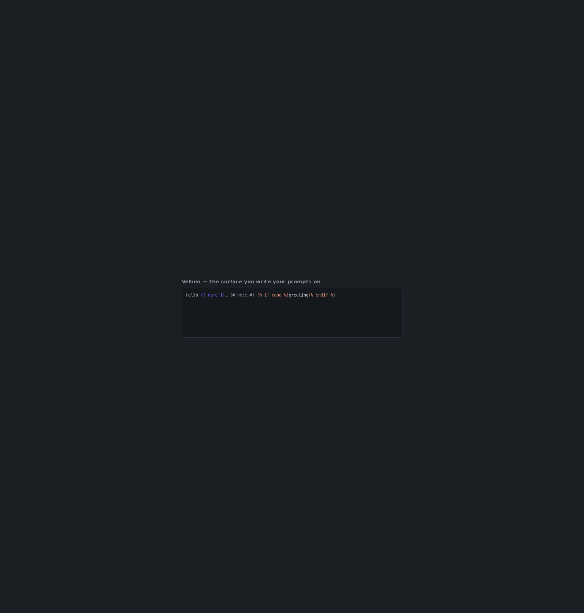

# Vellum

> **Vellum: the surface you write your prompts on.**

A lightweight, Rust-cored, web-native code/prompt editor engine — built to escape the
curse that 9 of 10 editors are just another Monaco/VSCode fork.

**Status: pre-alpha, private until Increment 0.** The repository remains private until the
walking-skeleton demo is judged to shine; it then flips public for Akaisys visibility
(see [ADR-0005](docs/adr/0005-repo-packaging.md)).

---

## Why not Monaco / CodeMirror?

Monaco and CodeMirror are general-purpose editors carrying years of polyfills and hacks —
a `<span>` per token, `contenteditable` fighting the IME, hidden textareas — **because the
native platform APIs did not exist when they were built.** In 2026 they do.

Vellum only needs to be excellent at a small subset (prompts plus a few languages), so a
focused, pure, minimal-dependency engine wins on bundle size, security, reliability, and
maintainability — and frees us from the Monaco/VSCode-fork monoculture. The goal is **not**
to compete; it is to **consume the modern platform ourselves, built for tomorrow**.

An edit is an event. The document is an aggregate, each keystroke a domain event, and
undo/redo is the replay/reverse of those events — the same architecture the backend
breathes. The pure Rust `core` carries `#![forbid(unsafe_code)]`, minimal dependencies, and
typed errors; the only DOM-touching layer is the thin TypeScript view.

## The 2026 web platform we build on

| Tech | Status (mid-2026) | Problem it eliminates |
|------|-------------------|------------------------|
| **CSS Custom Highlight API** | Baseline since Jun 2025 (Firefox 140 closed the gap), cross-browser | Syntax highlighting by styling `Range` objects via `::highlight()` — **no `<span>` per token** (the thing that bloats Monaco/CodeMirror). |
| **CSS Anchor Positioning + Popover API** | Baseline 2026 (Chrome 125+, FF 147+, Safari 26) | Autocomplete, hover, diagnostics popups with **zero JS positioning library** (no Floating UI). |
| **Pretext.js** (Cheng Lou, 15KB) | Stable | DOM-free text measurement/layout via Canvas + arithmetic, ~500x faster, full i18n/bidi. We **learn from it**, do not depend on it. |
| **EditContext API** | Chromium-only (Chrome/Edge 121+); **not** Baseline (no Safari/Firefox yet) | Native IME/composition for custom editors — the one non-portable piece, handled via progressive enhancement. |

## Architecture

```
crates/
  core/        # PURE Rust. Rope buffer, event-reified edits + undo/redo, cursor,
               # offsets, the Language port + generic highlight vocabulary.
               # #![forbid(unsafe_code)]. Minimal deps. NO browser, NO WASM here.
  lang-jinja/  # First Language plugin: the Jinja2 tokenizer behind core's port.
  wasm/        # wasm-bindgen bindings: expose core to JS. Emits token ranges.
ts/
  view/        # Thin view: Highlight API + InputSource + layout. The only DOM layer.
  react/       # React/Next wrapper for the consumer (later increments).
```

Dependency direction is strict and one-way — each layer depends only on the one to its
left (outer depends on inner): `core ← lang-jinja ← wasm ← ts/view ← ts/react`.
`core` knows nothing about the browser or about prompts.

## Build & Run

**Prerequisites:** Rust `1.89` (pinned via `rust-toolchain.toml`), the
`wasm32-unknown-unknown` target, [`wasm-pack`](https://rustwasm.github.io/wasm-pack/), and
[Bun](https://bun.sh/).

```bash
# Rust target + wasm tooling
rustup target add wasm32-unknown-unknown
cargo install wasm-pack            # if not already installed

# Build the WASM package the view consumes (outputs to ts/view/wasm/, gitignored)
bash scripts/build-wasm.sh

# Install JS deps and run the standalone playground
bun install
bun run --cwd ts/demo dev          # open the printed http://localhost:5173/
```

Type Jinja2 (`{{ variable }}`, ``, `{# comment #}`) and watch it highlight
live — every edit round-trips through the Rust core in WASM, and coloring is painted with
the **CSS Custom Highlight API** (no `<span>` per token):



### Checks (what CI runs)

```bash
cargo fmt --all -- --check
cargo clippy --all-targets -- -D warnings
cargo test
cargo deny check
wasm-pack test --node crates/wasm
bun run check        # tsc --noEmit (strict)
bun run test         # vitest
```

## License

Licensed under the [Apache License, Version 2.0](LICENSE).
